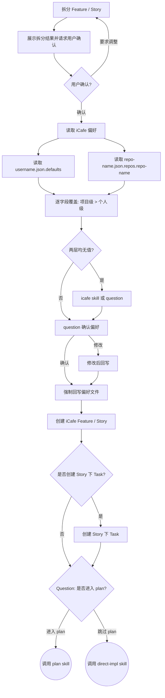

## 目标

将已澄清的需求拆分为 iCafe Feature / Story 卡片，作为百度内部研发活动和提交绑定的承载。

## 流程

按顺序完成下面流程。本 skill 主要创建和确认 iCafe 承载卡片，不使用 TodoWrite

1. 拆分 Feature / Story
2. 展示拆分结果并请求用户确认
3. 读取 iCafe 偏好
4. 创建 iCafe Feature / Story
5. 可选创建 Story 下 Task 卡片

### 拆分 Feature / Story

只创建 1 个 Feature，Feature 描述整体需求；Story 是后续提交绑定单位。

每张 Story 必须满足：

1. 有明确可验收交付物，而不是“开发某模块”这类描述
2. 可独立开发，不依赖其他 Story 的代码才能启动
3. 单一职责，一个端或一条业务链路，不跨端、不跨链路
4. 来自 `think` / `design` 的代码库调研，明确标注改造现有模块或新增模块
5. 标注关注文件与目录，写入 Story 描述

拆分策略：

| 判断条件 | 动作 | 理由 |
| --- | --- | --- |
| 同一业务链路的连续步骤 | 合并 | 保持业务完整，便于验收 |
| 存在代码依赖 | 合并 | 保证可独立开发 |
| 拆分后粒度过小 | 合并 | 避免卡片碎片化 |
| 技术栈不同且可独立交付 | 分开 | 便于并行开发 |
| 跨端，例如前端和服务端 | 分开 | 端是拆分的最小边界 |

标题格式：`【SDD】【<端名称>】【<模块/服务名>】<功能描述>`

### 展示拆分结果并请求用户确认

创建卡片前必须展示拆分结果，并使用 question 工具等待用户确认

展示格式：

```markdown
需求拆分完成

#### 需求概览
[1-2 句话描述核心目标]

#### 拆分思路
[说明关键的合并/拆分判断；若无特殊决策则省略此节]

#### Feature
| 序号 | 卡片标题 | 卡片内容描述 |
| --- | --- | --- |
| 1 | [Feature 标题] | [整体需求描述] |

#### Story 列表
| 序号 | 端 | 卡片标题 | 卡片内容描述 | 关注文件与目录 | 依赖 |
| --- | --- | --- | --- | --- | --- |
| 1 | 前端 / 服务端 / SDK / 其他 | [Story 标题] | [目标和范围] | [路径列表] | [依赖或无] |
```

若用户选择不调整，直接进行下面读取 icafe 偏好以及创建卡片流程。若用户要求调整时，修改拆分结果并重新展示；用户确认前不要创建卡片。

### 读取 iCafe 偏好

偏好分为两层：个人偏好（跨仓库共享，默认值）和项目偏好（按仓库独立，覆盖个人偏好）。

**个人偏好文件**: `<HOME>/.comate/icafe/${COMATE_USERNAME}.json`（`defaults` 节点）

**项目偏好文件**: `<HOME>/.comate/icafe/<repo-name>.json`（`repos.<repo-name>` 节点, `<repo-name>` = 当前工作目录 git repo 的 basename）

两层字段一致: space、cardType、plan、projectCard、featureRequired、storyRequired、autoSplitTask、updatedAt。

**取值规则**: 先用项目偏好 `repos.<repo-name>`, 项目偏好没有的字段用个人偏好 `defaults` 补齐; 都没有则通过 iCafe 查询或询问用户获取。

**保存规则**: 用户确认或首次填写后, 立即回写到对应偏好文件的对应节点并更新 `updatedAt`, 实现知识沉淀。

**执行步骤**:

1. **读取并展示个人偏好**:
   - 使用 `read_file` 工具读取 `<HOME>/.comate/icafe/${COMATE_USERNAME}.json`, 展示完整**绝对路径**和 `defaults` 节点原始 JSON
   - 文件不存在时明确告知路径并说明将创建

2. **读取并展示项目偏好**:
   - 使用 `read_file` 工具读取 `<HOME>/.comate/icafe/<repo-name>.json`, 展示完整**绝对路径**和 `repos.<repo-name>` 节点原始 JSON
   - 文件不存在时明确告知路径并说明将创建

3. **合并并展示最终结果**: 逐字段列出最终值与来源（个人偏好 / 项目偏好 / 缺失待填）

4. **处理缺失字段（主动沉淀）**:
   - 对于缺失字段, **优先调用 `icafe` skill 查询可用选项**:
     - `space` 缺失 → 调用 `icafe-cli space latest` 获取最近访问的空间列表
     - `plan` 缺失 → 调用 `icafe-cli plan list --space <space>` 获取可用迭代计划
     - `cardType` 缺失 → 调用 `icafe-cli space issue-types --space <space>` 获取可用卡片类型
     - `projectCard` / `featureRequired` / `storyRequired` 缺失 → 通过 question 询问用户
   - 将查询到的选项展示给用户选择, 用户选择后立即标记为待回写

5. **使用 question 工具向用户展示全部信息**, 必须包含两个维度的内容:

   **维度一: 偏好文件路径（方便用户直接编辑）**
   - 个人偏好绝对路径
   - 项目偏好绝对路径（或标注将新建）

   **维度二: 合并后偏好详情**

   question 格式:

   ```
   标题：iCafe 偏好确认

   选项：
   1. 确认使用（推荐） description: 按上述合并后的偏好创建卡片, 缺失字段已自动回写
   2. 需要修改 description: 可在 Other 中指定需要调整的字段和值
   ```

   question prompt 结构:

   ```markdown
   #### 偏好文件路径（可直接编辑）
   - 个人偏好: <绝对路径>
   - 项目偏好: <绝对路径 或 将新建>

   #### 合并后最终偏好
   | 字段 | 最终值 | 来源 |
   | --- | --- | --- |
   | space | <值> | 个人偏好 / 项目偏好 / 本次新填 |
   | cardType | <值> | ... |
   | plan | <值> | ... |
   | projectCard | <值> | ... |
   | featureRequired | <值> | ... |
   | storyRequired | <值> | ... |
   | autoSplitTask | <值> | ... |
   ```

6. **条件回写偏好（值变化时才写入）**:
   - 比较最终偏好值与读取时的原始值, 判断是否有变化
   - **值有变化或首次填充缺失字段时**:
     - 使用 `write_file` 或 `edit_file` 将变更后的偏好值回写到对应的偏好文件
     - 个人偏好 → 写入 `<HOME>/.comate/icafe/${COMATE_USERNAME}.json` 的 `defaults` 节点
     - 项目偏好 → 写入 `<HOME>/.comate/icafe/<repo-name>.json` 的 `repos.<repo-name>` 节点
     - 更新 `updatedAt` 为当前日期
     - 若文件不存在则创建完整结构
     - 告知用户: 「偏好已更新并保存至 <路径>」, 并展示变更的 diff 摘要
   - **值无变化时**:
     - 不执行写文件操作
     - 告知用户: 「偏好配置未变化, 已确认（上次更新: <原有 updatedAt>）」
     - 这避免了无意义的磁盘 I/O, 同时让用户知道流程已正常完成

7. 以最终偏好进入创建卡片流程

### 创建 iCafe 卡片
#### 创建 feature/story 卡片

用户确认拆分结果和 iCafe 空间后，调用 `icafe` 创建卡片，参考 `references/action.md`。

创建规则：

1. 先创建 Feature 父卡片，再创建 Story 子卡片
2. Story 创建时通过 `parent` 同时绑定 Feature，不要创建后再 update 绑定
3. 先创建 Feature / Story；Story 下 Task 卡片仅在用户选择或偏好开启时创建
4. Feature 描述写入需求概述、代码库现状和任务总览
5. Story 描述写入背景、目标、详细说明、关注文件、技术要点和依赖
5. Feature / Story 创建时 必须 写入字段：是否Agentic任务=是

**每张 Story 创建完成后，执行以下步骤写入测试验证点：**

1. 以该 Story 的标题和描述内容为上下文，调用 `ac-generator` skill 生成功能验证点
2. 将生成的验证点通过 `icafe update-card` 追加到 Story 描述末尾，在【技术要点】之后新增【测试验证点】部分

写入 Story 描述时，【测试验证点】的 HTML 格式为：

```html
<h2>测试验证点</h2>
<ol>
  <li>[验证点1]</li>
  <li>[验证点2]</li>
</ol>
```

禁止跳过用户确认直接创建卡片；禁止创建非 Feature 类型父卡片或非 Story 类型子卡片。

#### 创建 Story 下 Task 卡片（可选）

创建 Feature / Story 后，根据用户偏好判断是否创建 Story 下 Task 卡片。

规则：

1. 如果项目偏好中已配置 `autoSplitTask`，按偏好执行
2. 如果项目偏好未配置，回退使用个人偏好 `${COMATE_USERNAME}.json` 中的 `defaults.autoSplitTask`
3. 两层偏好均未配置时，必须使用 question 工具询问用户是否创建 Story 下 Task 卡片
4. Task 卡片只描述 Story 内部步骤，不作为提交绑定单位
5. 拆分规则：按 Story 工时拆分，默认 1 人日 = 1 个 Task
6. 用户选择后，将 `autoSplitTask` 分别写入项目偏好 `repos.<repo-name>` 和个人偏好 `defaults` 节点（两层都保存），并更新两边的 `updatedAt`
7. 如果用户选择创建，调用 `icafe` 在对应 Story 下创建 Task 卡片
8. Task 创建时必须通过 `parent` 绑定对应 Story，不要创建后再 update 绑定

#### 询问是否进入 `plan`

必须使用 question 工具询问用户是否进入 `plan`，问题必须包含两个选项：

- 进入 `plan`：生成 `tasks.md` 后按计划执行
- 跳过 `plan`：调用 `direct-impl` 直接基于 Story 开始实现

## 状态机


